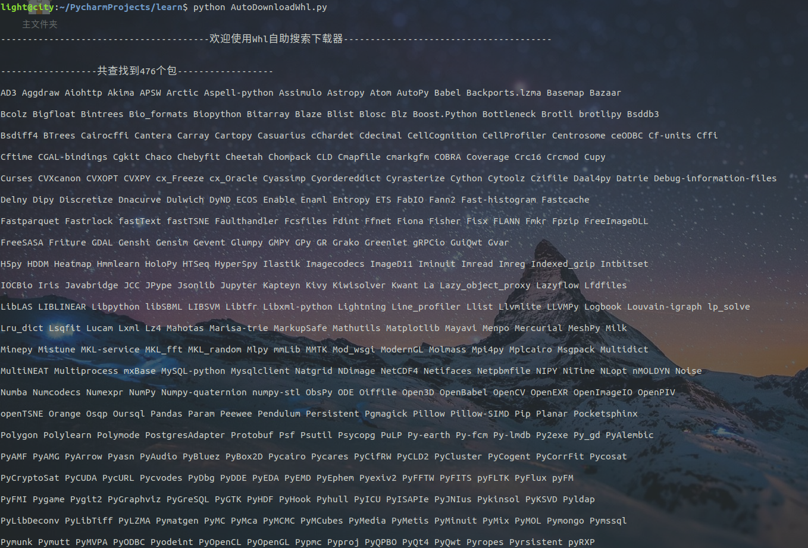
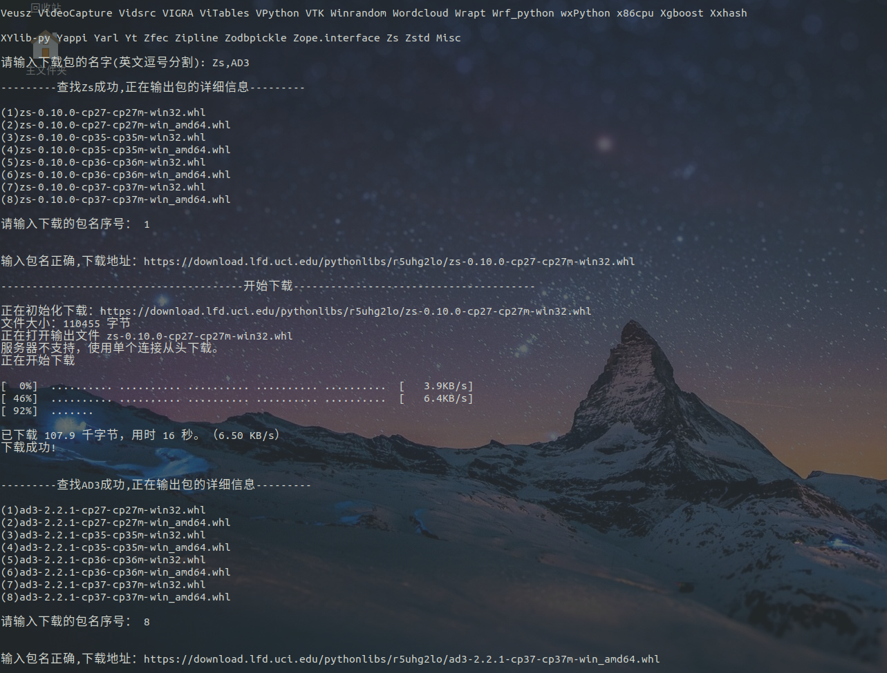
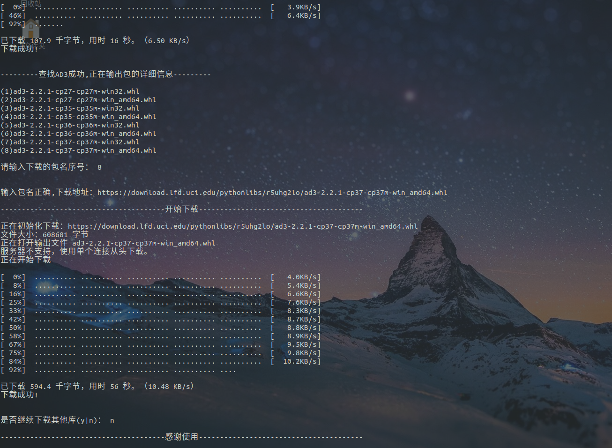

# 还在为pip安装发愁？whl自助脚本问世！

## 0.导语

在学习Python的过程中，大家肯定会遇到**pip安装失败的问题**，要么是因为网速问题，要么是因为win系统上与vs绑定，必须要装vs等一些系列问题，而这些问题有个很关键的解决办法，那就是直接下载相应的whl包来安装。

所以，我就想到，如果有一个能够支持搜索查找及下载whl包的脚本，那是不是很棒哦，果不其然，可以做到，让我时刻想到**需求来源于生活，技术用于提升工作效率！**

昨日花了一会时间写下这个脚本，并做了测试，今天来总结一下，欢迎大家star,fork,转发，收藏本篇文章！

源码地址：

> https://github.com/Light-City/AutoDownloadWhl

本次脚本我将它命名为：**Whl自助搜索下载器**

实现了如下功能：

- 支持检索
- 支持查找
- 支持下载
- 单、多文件下载

## 2.如何使用及功能演示

### 2.1 如何使用

运行脚本需要：

- requests、lxml、os库
- curl或axel命令

win系统的直接下载win版本的按照网上配置即可！

linux系统与mac系统可用yum 或 apt 或 brew等来进行安装！

复制源码地址并下载脚本，运行脚本即可：

```
python AutoDownloadWhl.py
```

### 2.2 功能演示

- 所有包信息展示
- 适应平台whl包
- 多包下载

完整演示如下：





## 3.代码详解

### 3.1 封装

封装包地址与下载地址：

```python
class AutoDownWhl():
    def __init__(self):
        # 包地址
        self.url = 'https://www.lfd.uci.edu/~gohlke/pythonlibs/'
        # 下载地址
        self.base_url = 'https://download.lfd.uci.edu/pythonlibs/r5uhg2lo/'
        # 模拟浏览器
        self.headers = {
            'User-Agent': 'Mozilla/5.0 (X11; Linux x86_64) AppleWebKit/537.36 (KHTML, like Gecko) Chrome/72.0.3626.96 Safari/537.36'
        }
```

### 3.2 获取选择器与包名

解析源码与获取包名：

```python
# 获取选择器与包名
def getLib(self):
    raw_text = requests.get(self.url, headers=self.headers).content
    seletor = etree.HTML(raw_text)
    lib_names = seletor.xpath('//ul[@class="pylibs"]//li//strong//text()')
    return seletor, lib_names
```

### 3.3 输出所有包名

一行15个包名打印：

```python
# 输出所有包名
    def print_AllLib(self, lib_names):
        print('\n------------------共查找到' + str(len(lib_names)) + '个包------------------\n')
        for i in range(len(lib_names)):
            if i and i % 15 == 0:
                print('\n')
            print(lib_names[i], end=' ')
```

### 3.4 搜索与下载

只摘取了核心代码，下载采用调用系统命令curl与axel，请在自己的系统上安装这两个其中之一下载！

```python
def searchDown(self, downloadMethod='axel'):
    # 此部分代码只摘取核心部分
    if int(lib_sequence) <= max:
        detail_name = detail_libs[int(lib_sequence) - 1].strip().replace('‑', '-')
        download_url = self.base_url + detail_name
        print('\n\n输入包名正确,下载地址：' + download_url + '\n')
        print("---------------------------------------开始下载---------------------------------------\n")
        if downloadMethod == 'curl':
            cmd = 'curl -O %s' % download_url
        else:
            cmd = 'axel %s' % download_url
        while True:
            cmd_res = os.system(cmd)
            if cmd_res == 0:
                print('下载成功!\n')
                break
            else:
                print('下载失败!\n')
                is_try = input('是否重试下载(y|n)： ')
                if is_try == 'y' or is_try == 'Y':
                    continue
                else:
                    break
    else:
        print("\n \033[1;31m 输入序号不符合要求,请重新输入！ \033[0m \n")
```

### 3.5 调用

采用axel下载：

```python
dw = AutoDownWhl()
dw.searchDown(downloadMethod='axel')
```


